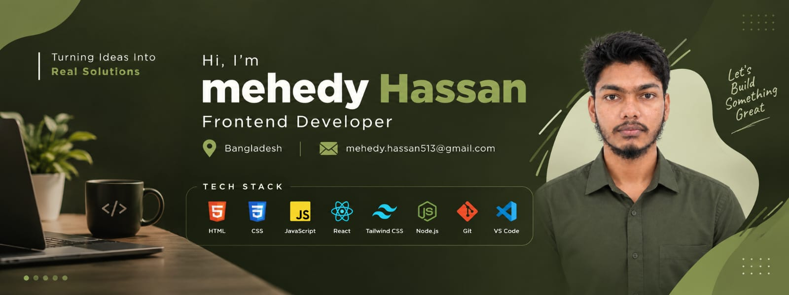

  

 

<h1 align="center">Hi 👋, I'm Mehedy Hassan</h1>

<h3 align="center">
  Web Developer | React Developer
</h3>

  
  

---

## 👨‍💻 About Me

I'm **Mehedy Hassan**, a web developer from **Chittagong, Bangladesh**,
passionate about creating modern, responsive and user-friendly web
applications.

I enjoy learning new technologies, building projects and continuously
improving my development skills.

### 🚀 Currently

- 🌱 Exploring modern **React** development
- ⚛️ Building projects with **React & Tailwind CSS**
- 🟢 Learning and working with **Node.js**
- 🗄️ Improving my **MySQL & database** skills
- 💡 Practicing problem solving through development
- 🔨 Building projects to strengthen my real-world development skills

---

## 🛠️ Skills & Technologies

### 🌐 Frontend Development

  

### ⚙️ Backend & Database

  

### 🔧 Tools

  

---

## 🎯 Development Focus

---

## 📊 GitHub Statistics

  

  

## 💻 Most Used Languages

  

---

## 🌐 Connect With Me

---

  

---

  <strong>✨ Thanks for visiting my profile! ✨</strong>

  <i>Keep Learning • Keep Building • Keep Growing 🚀</i>

